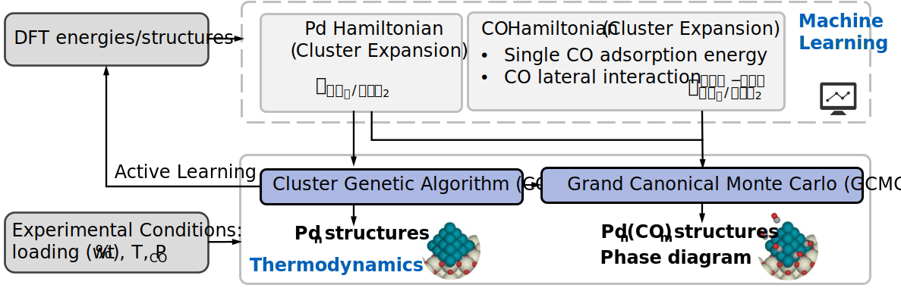

# Pdn-CO-Stability
 Dataset, machine learning models and Monte Carlo simulations in Python for evaluating stability of subnanometer CO-adsorbed Pdn clusters supported on Ceria

## Computational Framework 

Notes:
- Machine learning models are efficient structure-to-energy mappings
- Low energy indicates higher stability 
- Monte Carlo simualtions are used to optimize the strutcure 

## Dataset 
The dataset contains Pdn cluster structures in the size range from 1 to 21, descriptors and CO-CO interactions.
- [Cluster structures from DFT calculations](/dataset/DFT_structures)
- [Descriptors for single CO adsorption](/dataset/descriptors)
- [CO-CO interactions for multiple CO adsorption](/dataset/interactions)

## Pdn cluster energy model 
The machine learning model to predict Pdn energy from a given structure
- [Pdn-CE](/Pdn-CE)

## CO adlayer energy model 
The machine learning model to predict CO adlayer energy from a given structure
- [CO-CE](/CO-CE)

## Structure optimization algoirthms in Grand Cannoical ensembles 
[Grand Cannoical Monte Carlo (GCMC)](/GCMC)

Automatic discovery of optimal (lowest free energy) adsorbate layer structures at a given temperature and CO pressure 

## Dependencies 
- Python version 3.6+
- [Numpy](https://numpy.org/): Used for vector and matrix operations
- [Matplotlib](https://matplotlib.org/): Used for plotting
- [Scipy](https://www.scipy.org/): Used for linear algebra calculations
- [Pandas](https://pandas.pydata.org/): Used to import data from Excel files
- [Sklearn](https://scikit-learn.org/stable/): Used for training machine learning models
- [Seaborn](https://seaborn.pydata.org/): Used for plotting
- [Networkx](https://networkx.github.io/): Used for graph opertations
- [ase](https://wiki.fysik.dtu.dk/ase/index.html): Used for atomic structure representation

## Publication
